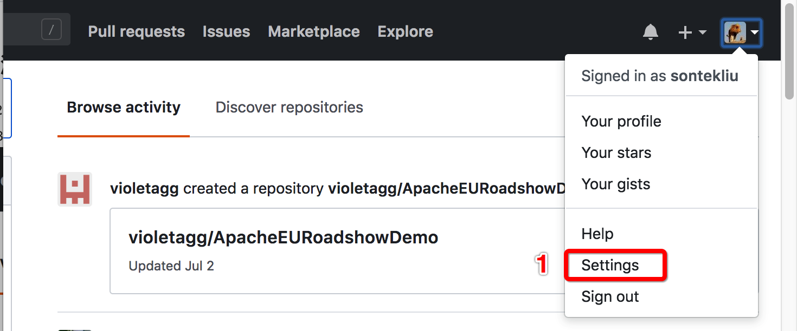
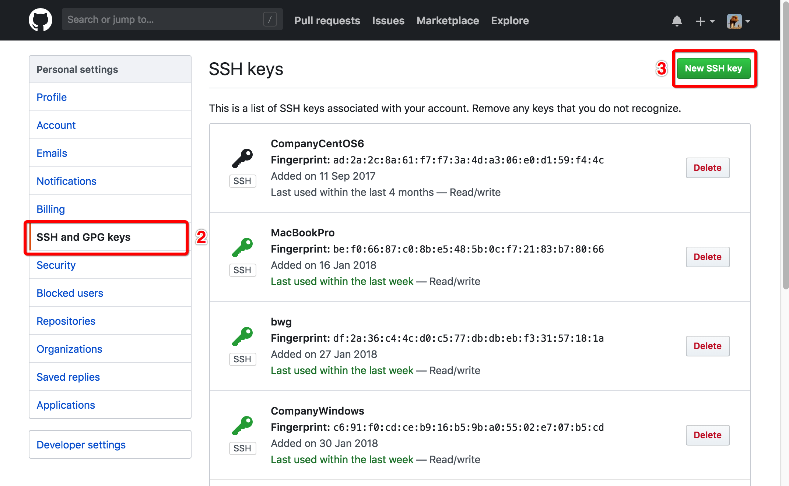
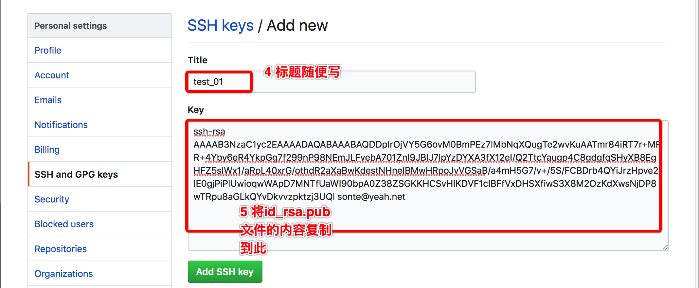
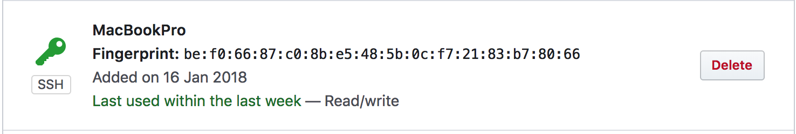

# Git 远程仓库的配置

虽然 `Git` 是完全分布式版本控制系统，但是在实际的开发过程中，一般还是会单独创建一个服务器作为中心服务器，方便团队成员之间共享代码。如何连接远程仓库呢？下面就以 `Github` 为例演示如何连接一个共享的 `Git` 仓库，当然在公司中一般都会有自己的 `Git` 服务器。

#### 1. 创建 SSH Key

首先检查操作系统宿主用户目录下是否已存在 `.ssh` 目录，如果存在，再检查其目录下面是否存在 `id_rsa` 和 `id_rsa.pub` 文件，如果已存在，则跳过该步，否则执行如下代码：

```shell
$ ssh-keygen -t rsa -C "youremail@example.com"
```

把邮件地址换成你自己的邮件地址，然后一路回车即可，最后在宿主目录下面生成 `.ssh` 目录，并在该目录下面生成 `id_rsa` 和 `id_rsa.pub` 文件。`id_rsa` 是私钥，不要泄露给别人，`id_rsa_pub` 是公钥，可以开放给任何人。

#### 2. 登录 Github，添加 SSH Key

1. 登录 `Github` 账号，并进行配置

   

2. 找到添加 SSH Key 的菜单

   

3. 添加 SSH Key

   

4. 完成

   

#### 3. 与远程仓库建立连接

首先在 `Github` 上创建一个仓库。然后再将本地仓库（已存在）与远程仓库进行连接。具体连接如下：

```shell
$ git remote add origin https://github.com/sontekliu/git_tutorial.git
$ git push -u origin master
```

