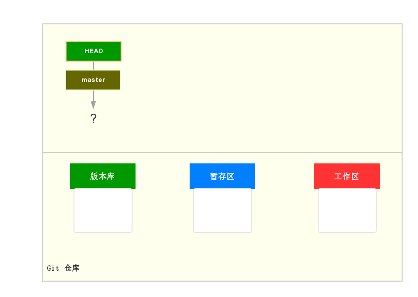
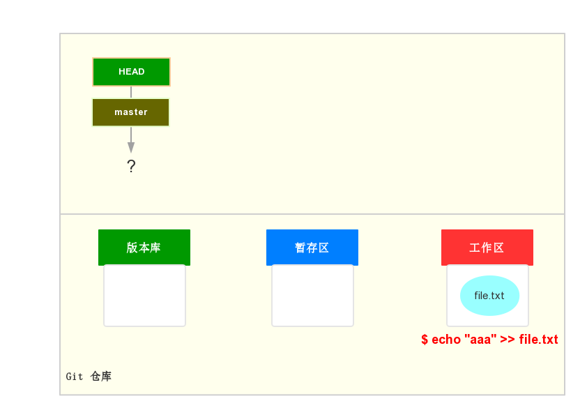
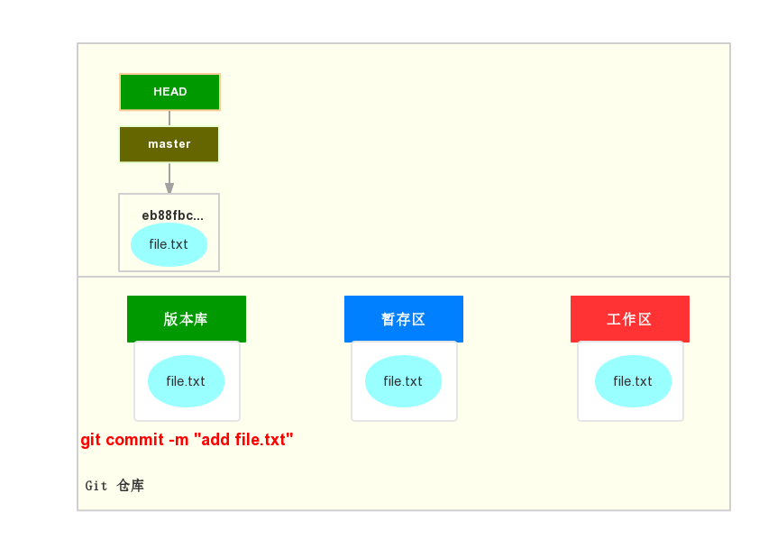
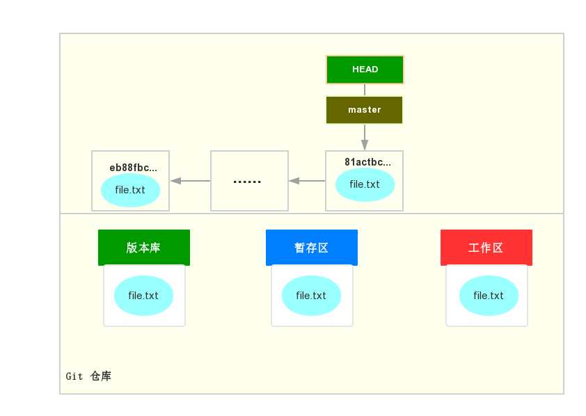

# Git 基本流程

#### 1. 创建远程仓库

```shell
$ git init --bare learngit.git
```

#### 2. 克隆远程仓库

```shell
$ git clone git@192.168.3.71:/home/gitrepo/learngit.git
```

默认克隆下的空的仓库如图所示：



#### 3. 向仓库中添加或修改文件

```shell
$ echo "Learn Git" >> README.md
```

向仓库中添加文件，如图



#### 4. 查看仓库状态

```shell
$ git status
```

#### 5. 将修改内容添加到暂存区

```shell
$ git add <filename> # git add .
```

如图：


#### 6. 将修改内容提交到本地仓库

```shell
$ git commit -m "add README.md file"
```




#### 7 从远程仓库更新

```shell
$ git pull
```

#### 8. 提交到远程仓库

```shell
$ git push origin master
```

此时的状态如图所示：



#### 9. 查看提交日志

```shell
$ git log        # git log --pretty=oneline
```


