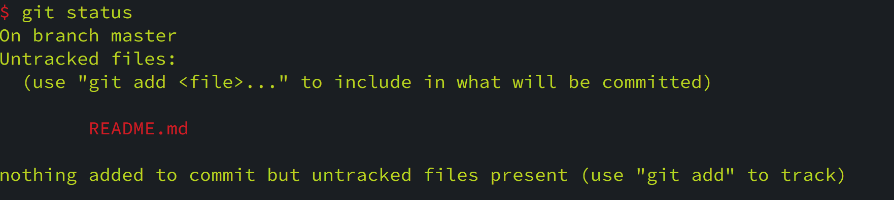
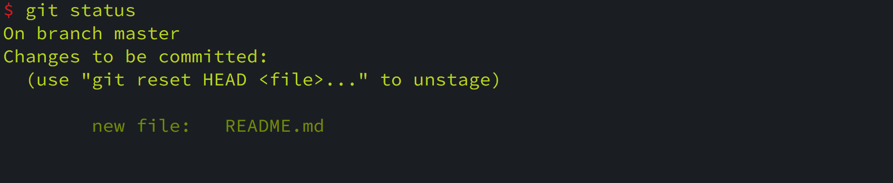
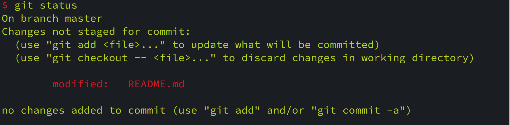
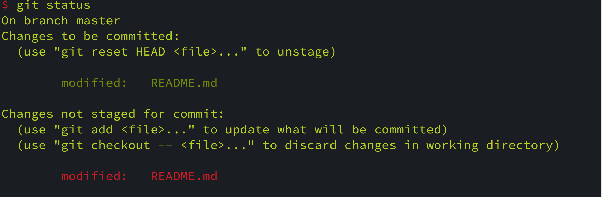
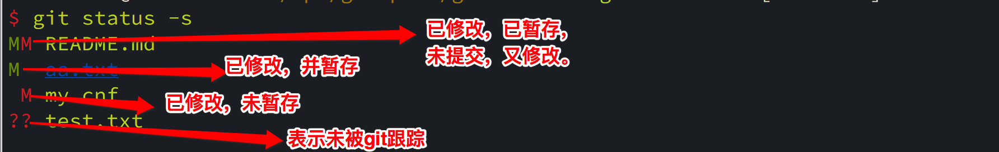

# Git 状态查看命令 git status

#### 1. git status

`git status` 主要用于显示仓库中文件所处状态。

* 未被 `Git` 追踪，即没有提交历史
* 已暂存，但还未提交的状态
* 已修改，但未暂存的状态

1. 未被 `Git` 追踪的效果

   

2. 已加入暂存区但是还未提交的文件

   

3. 已修改，但未暂存

   

4. 已修改，已暂存，未提交，又修改

   

#### 2. git status -s

`git status -s` 是以简略的方式显示仓库中文件所处的状态，如下所示：

