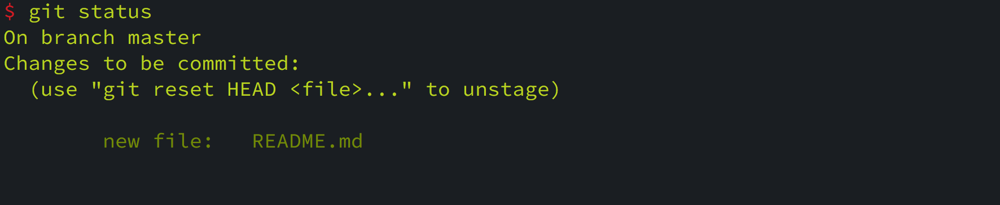

# 记录每次更新

获取到 `Git` 仓库之后，就是对仓库中的文件进行操作了，下面先看一下仓库中文件的生命周期图，如下图：


#### 1. 创建并跟踪文件

```shell
$ git add <file or dir> 
```

添加文件或者目录到暂存区，如果是目录，则会递归目录下的文件，即将该目录下面所有未跟踪的文件添加到暂存区。

#### 2. 查看仓库文件状态

```shell
$ git status
```

`git status` 主要用于显示仓库中文件所处状态。

1. 未被 `Git` 追踪的效果

   

2. 已加入暂存区但是还未提交的文件

   

3. 已修改，但未暂存

   

4. 已修改，已暂存，未提交，又修改

   


**状态简览**

`git status -s` 是以简略的方式显示仓库中文件所处的状态，如下所示：


#### 3. 提交更新

```shell
$ git commit <files...> -m "messages..."
```

`git commit ` 表示将暂存区的 `files` 文件快照提交到版本库，如果 `files` 为空，表示将暂存区的所有快照信息提交到版本库。

```shell
git commit <files...> -a -m "messages..."
```

`-a` 选项表示跳过暂存区域直接提交到版本库。

#### 4. 移除文件

移除文件确切的说是从暂存区域移除，移除文件分两种情况，第一、从暂存区域移除，并从硬盘删除。第二、从暂存区域移除，但是文件依然在仓库中，不进行物理删除。

**第一、移除文件并删除***

```shell
$ git rm <files...>
```

执行此命令之后，下次提交时，文件就不被纳入版本管理了。如果执行此命令前，修改过该文件并且已经放到到暂存区，此时必须添加 `-f` 参数，即 `git rm -f filename` 表示强制删除，这是一种安全特性，防止误删数据，因为这样的数据不能被 `Git` 恢复。

**第二、移除文件但不删除**

```shell
$ git rm --cached file
```

从暂存区移除文件，但是不对文件进行物理删除。

#### 5. 移动文件

```shell
$ git mv file_form file_to
```

对文件进行移动，相当于如下三条命令：

```shell
$ mv file_from file_to
$ git rm file_form
$ git add file_to
```

