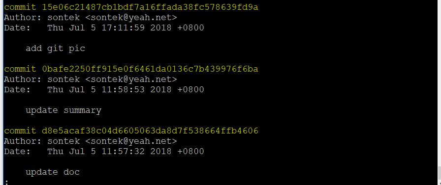

# Git 提交记录

提交了若干更新，或者克隆了某个项目之后，你可能想浏览一下历史提交。要实现此功能，可以使用 `git log` 命令。

```shell
$ git log
```

默认不使用参数的话，`git log` 会按照时间倒序列出所有的提交，最近的提交显示在上面，默认会列出如下内容：SHA-1值、作者的名字、作者的电子邮件、提交时间、以及提交说明，如图所示：

 

* -n 	显示最近 n 次提交的历史
* -p    显示每次提交的内容差异
* --pretty=oneline  显示一行
* --graph   形象的展示提交历史，分支合并
* --author=author_name  仅显示指定作者的提交
* --since，--after   仅显示指定时间之后的提交
* --until，--before 仅显示指定时间之前的提交

