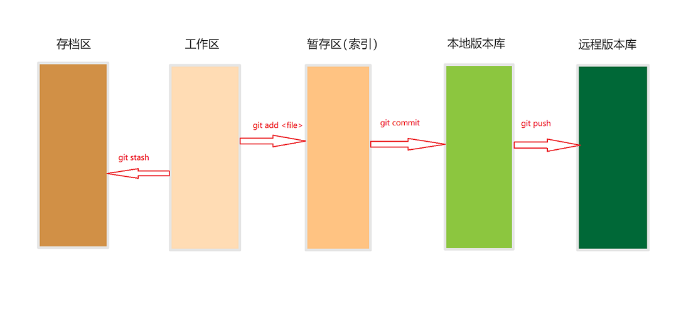

# 基本概念

我们先来了解一下 `Git` 工作的几个区间，根据官方文档，一般将 `Git` 分为三个区域，但是根据正常的工作情况，我将 `Git` 大体分为 5 个区域，如下图： 

* **工作区** 

  就是你在电脑里面能看到的目录。

* **暂存区（索引）**

  暂存区，也叫索引，一般存放在 `.git` 目录下面的 `index` 文件中。

* **本地版本库**

  工作区有一个隐藏的目录 `.git` 这个不是工作区，就是 `Git` 的版本库。

* **远程版本库**

  和**本地版本库**一样，只不过是存在于远程服务器。远程服务器是不存在工作区的。

* **存档区**

  考虑一种场景，假如你正在 `dev` 分支上进行开发，开发还未完成，此时需要创建一个临时分支来紧急修复一个 `Bug ` ，但是在 `dev` 上的修改又不能提交，同时也不想引入到临时创建的 `Bug` 分支，此时可以通过 `git stash` 命令将修改内容暂时存储起来，等 `bug` 修改完再接着开发未完成的任务。将修改内容暂时存储起来的区域就是**存档区**。

