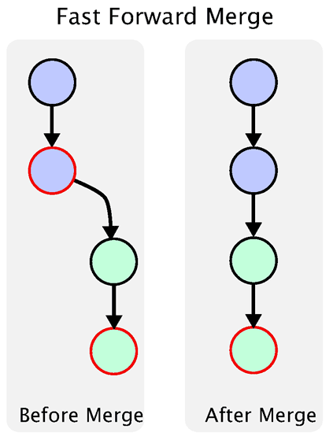
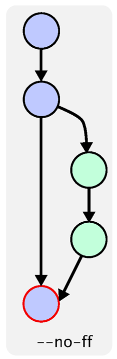

# 分支合并与合并冲突

#### 1. 分支合并

* 快速合并

  关于合并这块，文字描述起来可能没有示例+示图的方式效果好，下面我就已示例+示图的方式讲解分支合并。

  场景：

  1. 创建本地仓库，添加 `README.md` 并提交

     ```shell
     $ git init git_branch
     $ cd git_branch
     $ echo "AAAA" >> README.md
     $ git add README.md
     $ git commit -m "init README.md"
     ```

  2. 创建 `dev` 分支，并切换到 `dev` 分支

     ```shell
     $ git checkout -b dev
     ```

  3. 在 `dev` 分支上修改 `README.md` 文件多次，并进行多次提交

     ```shell
     $ echo "bbbb" >> README.md
     $ git commit -a -m "update README.md add bbbb on dev branch"
     $ echo "cccc" >> README.md
     $ git commit -a -m "update README.md add cccc on dev branch"
     $ echo "dddd" >> README.md
     $ git commit -a -m "update README.md add dddd on dev branch"
     ```

  4. 切换到 `master` 分支，查看 `README.md` 文件，看是否有在 `dev` 分支上的修改

     ```shell
     $ git checkout master
     $ cat README.md
     AAAA                      # 没有在 dev 分支上添加的 bbbb cccc dddd
     ```

  5. 合并 `dev` 分支到 `master` 分支，并查看历史提交

     ```shell
     $ git merge dev -m "merge dev to master"   # 此时处于 master 分支
     Updating 0ec51c7..75e171d
     Fast-forward (no commit created; -m option ignored)  # Fast-forward 快速合并标识
      README.md | 3 +++
      1 file changed, 3 insertions(+)
     $ git log --oneline --graph                # 注意提交纪录的次数，以及左侧的 * 号
     * 75e171d update README.md add dddd on dev branch
     * 059eabc update README.md add cccc on dev branch
     * f09db33 update README.md add bbbb on dev branch
     * 0ec51c7 init README.md
     ```

* 普通合并

  普通合并和快速合并基本一样的，唯一的区别是在合并的时候添加 `--no-ff` 参数，表示禁用快速合并。

  因为普通合并与快速合并的示例几乎是一样的，唯一的区别在第 5 步，所以在讲述普通合并的时候， 前 4 步的操作就不在此赘述。

  5. 合并 `dev` 分支到 `master` 分支，并查看历史提交

     ```shell
     $ git merge dev --no-ff -m          "merge dev to master no-ff"
     Merge made by the 'recursive' strategy.
      README.md | 3 +++
      1 file changed, 3 insertions(+)
     $ git log --oneline --graph        # 注意提交历史次数，以及左侧的 * 号
     *   191b379 merge dev to master with no-ff
     |\
     | * 75e171d update README.md add dddd on dev branch
     | * 059eabc update README.md add cccc on dev branch
     | * f09db33 update README.md add bbbb on dev branch
     |/
     * 0ec51c7 init README.md
     ```

     由以上两个日志比较可以发现，普通合并是将合并作为一次提交，而快速合并只是移动了一下 `HEAD` 指针，并不能分辨出有分支合并的迹象。

     看如下两图，再理解一下快速合并和普通合并的区别。

     

  

#### 2. 合并冲突

在项目开发过程中，发生冲突是非常常见的事情，冲突步仅仅在分支合并中出现，在同一分支由于不同的人同时修改同一个文件的同一个位置，这样就容易出现冲突。下面就以分支合并出现的冲突为示例，演示一下冲突出现的情况以及解决冲突的过程。示例场景还是接着上面的示例继续。

1. 在 `master` 分支，修改 `README.md` 文件，如下面代码：

   ```shell
   $ git checkout master
   $ echo "This is master add" >> README.md
   $ git commit -a -m "master update content and commit"
   $ cat README.md
   ```

2. 切换到 `dev` 分支上，修改 `README.md` 文件，如下代码：

   ```shell
   $ git checkout dev
   $ echo "This is dev add" >> README.md
   $ git commit -a -m "dev update content and commit"
   $ cat README.md
   ```

3. 切换到 `master` 分支，将 `dev` 合并到 `master` 分支

   ```shell
   $ git checkout master
   $ git merge dev --no-ff -m "merge dev to master with no-ff"
   ```

   