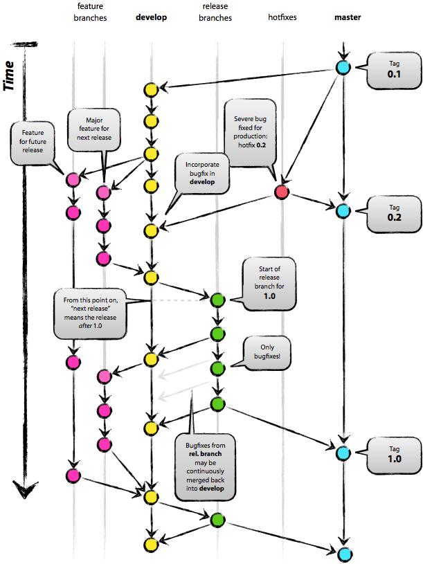

# Git 分支

一个成功的 `Git` 分支模型：

几乎所有的版本控制系统都以某种形式支持分支。就拿 `SVN` 来说，它也是支持分支的，但是 `SVN` 创建分支相当于是把整个项目复制一份，如果项目中文件很少还可以，但是如果文件非常多，那就既费时又费力。而对于 `Git` 来说，可以在瞬间生成一个新的分支，无论项目有多大，`Git` 总是能在 1 秒内创建完分支。如果快速的创建分支，得益于 `Git` 精巧的设计，这需要从 `Git` 如何存储数据说起。

`Git` 存储的不是文件各个版本的差异，而是文件的每一个版本存储一个快照对象，然后通过 `SHA-1` 索引，不只是文件，包换每个提交都是一个对象并通过 `SHA-1` 索引。无论是文本文件，二进制文件还是提交，都是 `Git` 对象。 所谓的 `Git` 分支，其实就是一个指向某一个 `commit`  对象的指针 ，所以创建分支非常迅速。

使用分支的好处也就不言而喻了，使用分支完全可以把你的工作从开发主线上分离开来，以免影响主线。如果分支的创建和切换非常缓慢或者痛苦的，那么分支也就成了摆设，没人会用。而 `Git` 的分支可称为**必杀特性**，也正因为这一特性，使得 `Git` 从其他版本管理系统中脱颖而出。所以 `Git` 的分支也就成了学习 `Git` 必学的一项内容。

