# Git Install

既然要使用 Git 那必须先安装 Git，一下提供的各个平台 Git 的安装方式。

### Windows 平台

在 Windows 平台上安装 Git，和安装其他软件类似，下载软件包，双击运行，然后一直下一步，直到完成即可。但是 Windows 的安装需要注意一下几点。  

首先从[官网](https://git-scm.com)下载对应的软件包，然后双击运行即可。本教程使用的版本是 Git-2.19.1-64-bit.exe 。

第一步，双击运行如下：
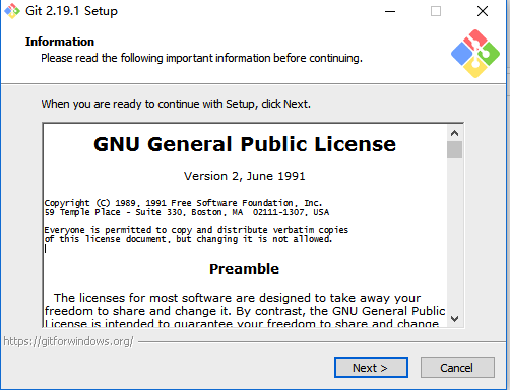  

第二步，选择安装目录，注意，安装目录最好不要带有空格  
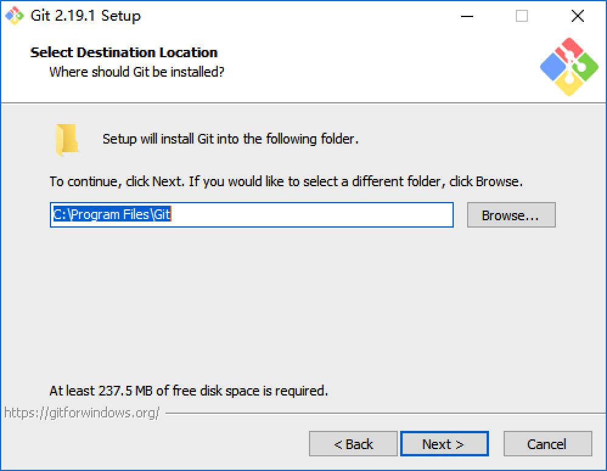  

第三步，选择需要安装的组件，默认即可。
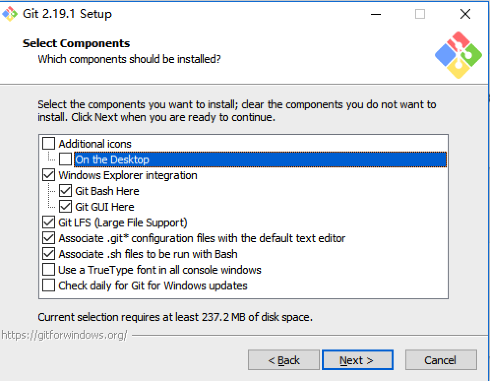  

第四步，设置 Windows 开始菜单的文件夹，默认即可  
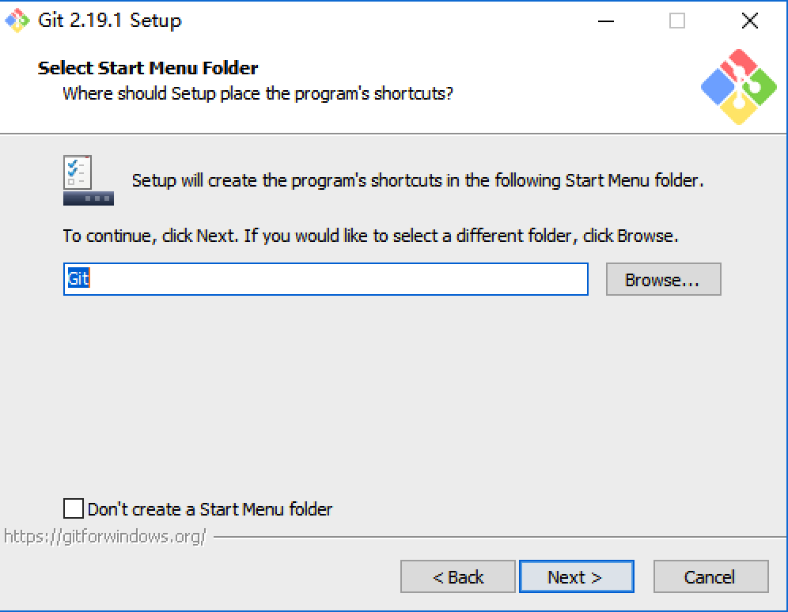  

第五步，设置 Git 使用的默认编辑器，默认为 Vim，使用默认即可  
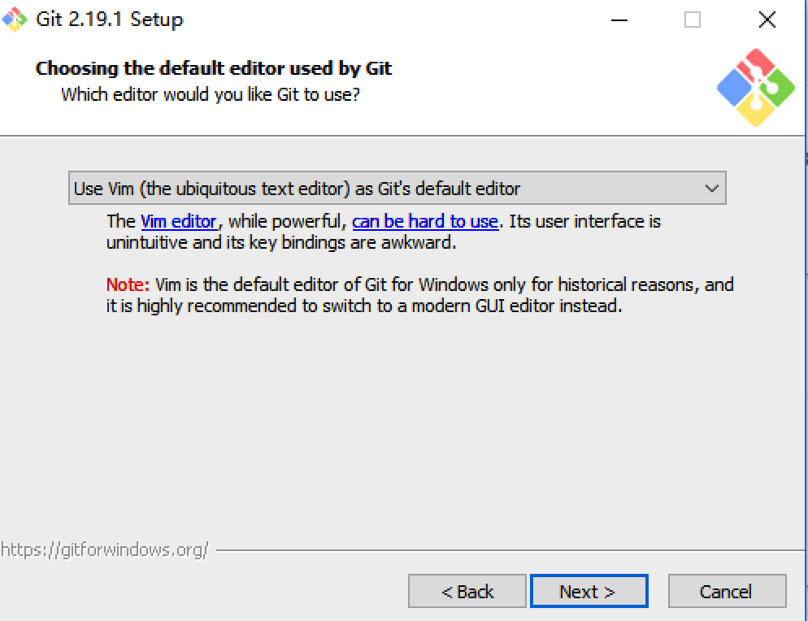  

第六步，设置 Git 的 PATH 环境变量，选择第一个即可。表示仅仅在 Git Bash 中使用 Git，第二个表示，可以在 Windows 命令提示符中使用 Git；第三个表示，在 Windows 命令提示符下面使用 Git，但是 Windows 环境变量的部分命令可能被 Unix 的命令覆盖。  
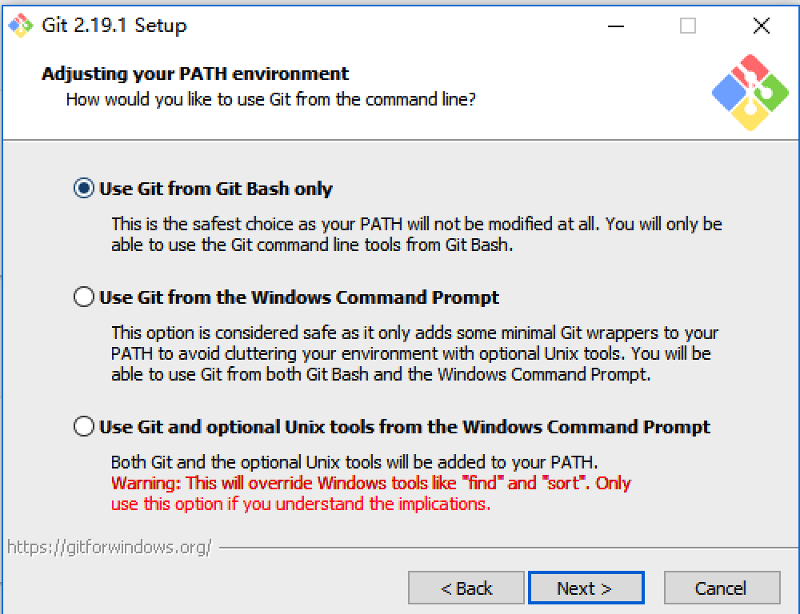  

第七步，设置后台数据传输的安全协议，默认即可  
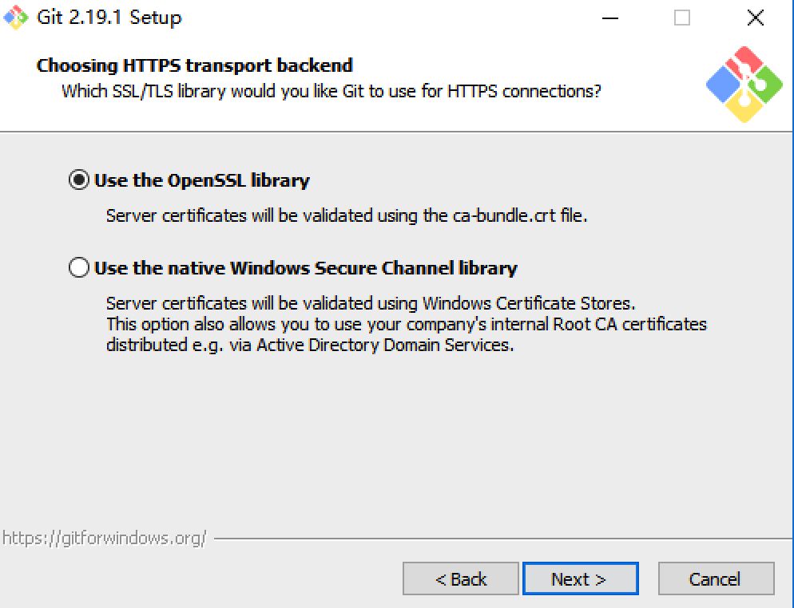  

第八步，配置 Git 换行符，选择第一个即可。  
Windows 平台与 Unix 平台表示换行的方式是不同的，Windows 使用 CRLF 表示，而 Unix 使用 LF 表示。第一个，表示检出时，使用 Windows 风格的换行符，但是提交的时候转换为 Unix 风格的换行符；第二个表示，检出时，使用文件原来的换行风格，提交时转换成 Unix 风格的换行符；第三个表示，检出时是什么风格，提交就是什么风格。  
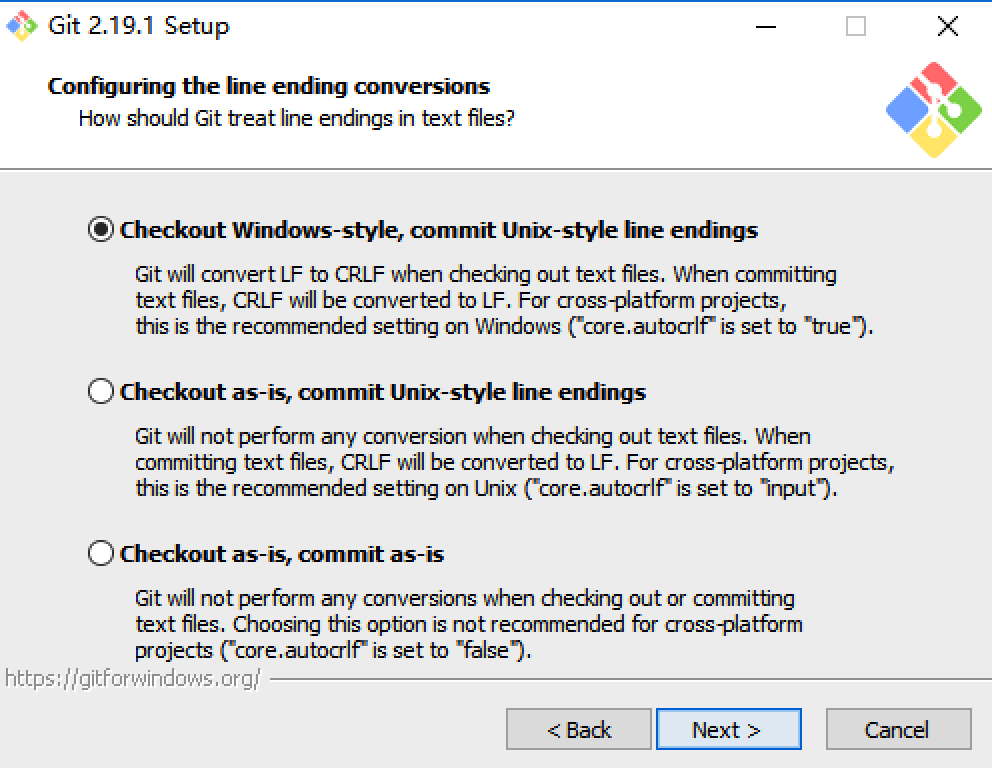  

第九步，配置 Git Bash 使用的终端模拟器，默认即可。  
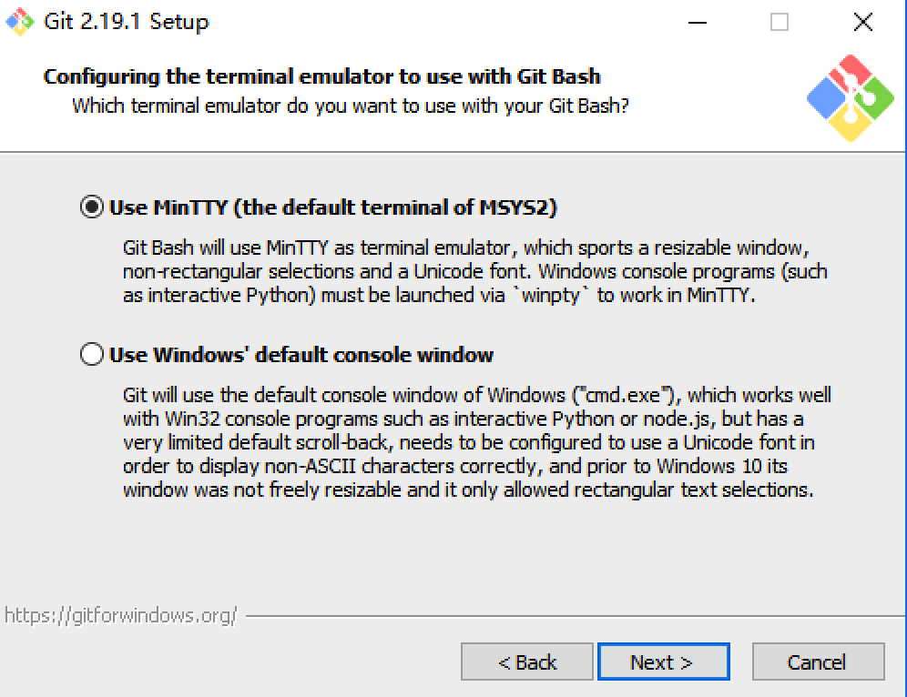  

第十步，配置 Git 的可选特性，默认即可。  
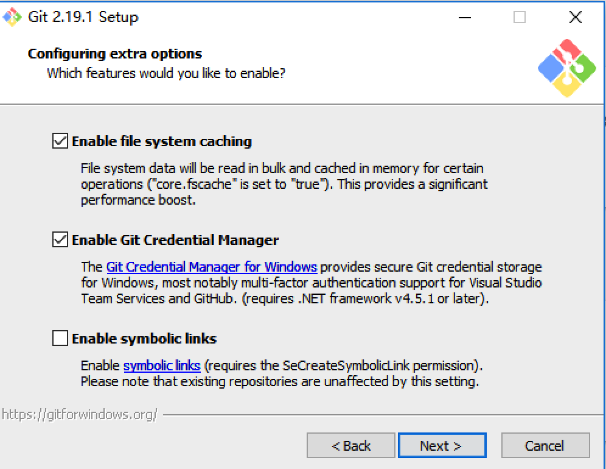  

第十一步，这是 Git 新版本的新特性，一些实验性选项，默认即可。  
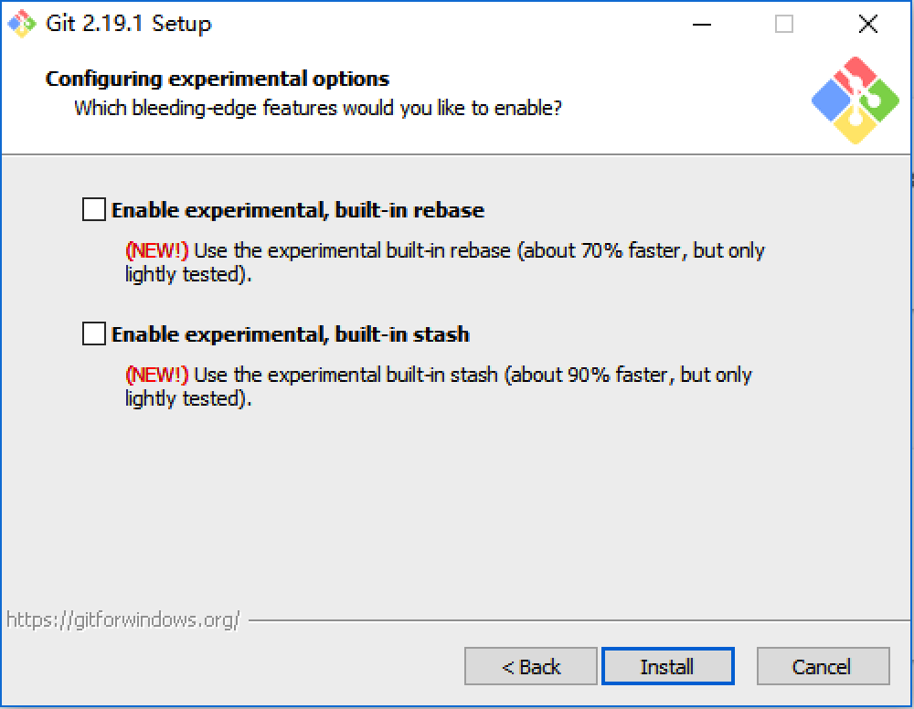  

第十二步，安装
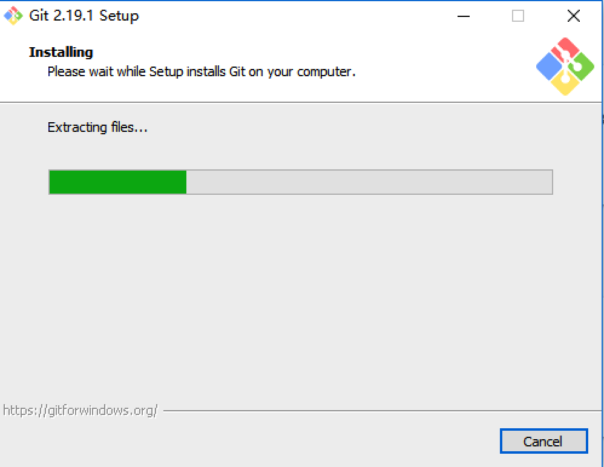  

第十三步，安装完成
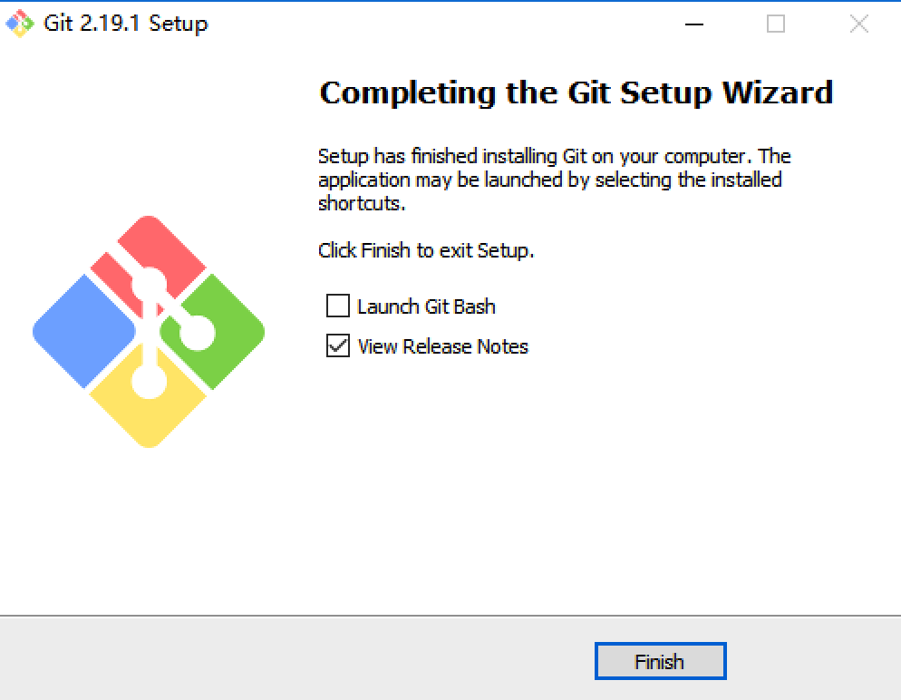  

第十四步，安装完成之后，在 Windows 系统的任何位置，使用鼠标右击，即可看到如下图内容，表示 Git 安装成功。
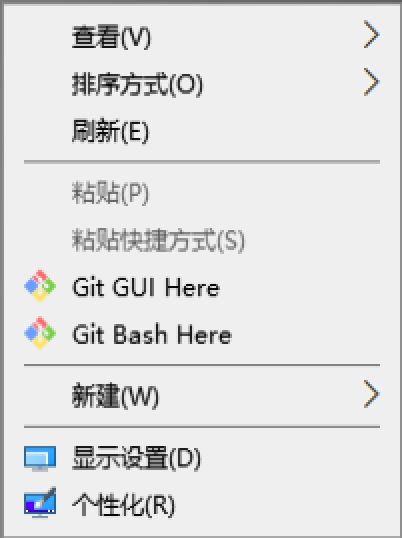  

### GUN/Linux 平台

* Fedora，CentOS，Redhat 平台：  

```shell
$ sudo yum install git
```

如果你在基于 Debian 的发行版上，请尝试用 apt-get：

```shell
$ sudo apt-get install git
```

### Mac 平台

```shell
$ brew install git
```

### 源码安装

如果使用的是 Linux 系统，可以从[这里](https://www.kernel.org/pub/software/scm/git/)下载 Git 最新版本。

```shell
$ tar -zxvf git-2.3.4.tar.gz # 解压缩此源码包
$ cd git-2.3.4
$ yum install curl-devel expat-devel gettext-devel openssl-devel zlib-devel
$ ./configure
$ make
$ make install
```

注意, 如果安装的是新版本,可能会出现如下错误:

```shell
 usr/bin/perl Makefile.PL PREFIX='/usr/local/git' INSTALL_BASE='' --localedir='/usr/local/git/share/locale'
 Can't locate ExtUtils/MakeMaker.pm in @INC (@INC contains: /usr/local/lib64/perl5 /usr/local/share/perl5 /usr/lib64/perl5/vendor_perl /usr/share/perl5/vendor_perl /usr/lib64/perl5 /usr/share/perl5 .) at Makefile.PL line 3.
 BEGIN failed--compilation aborted at Makefile.PL line 3.
 make[1]: *** [perl.mak] Error 2
 make: *** [perl/perl.mak] Error 2
 ```

以下是解决方案:

```shell
$ sudo yum install perl-ExtUtils-MakeMaker package
```

### 小结

本小结主要是讲述了 Git 在各个平台是如何安装的，着重截图讲解了 Git 在 Windows 平台下的安装注意事项，其实总体来说各个平台的安装还是比较简单的，安装已完成，下一节主要讲解一些 Git 安装完之后的配置。
