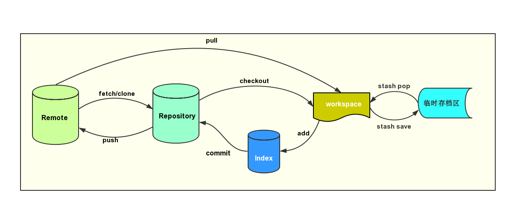

# Git 基本概念

在学习 Git 的基本使用之前，我们先来大体了解一下 Git 使用时的基本概念。

根据官方文档，一般将 Git 分为三个区域，但是从一般的工作情况来分，我将 Git 分为 5 个区域，如下图：

* **Workspace (工作区)**
    就是你在本地电脑创建版本库之后能看到的目录和文件

* **Index (索引或者暂存区)**
    索引，也叫暂存区，一般存放在 .git 目录下面的 index 文件中。

* **Repository (本地版本库)**
    工作区有一个隐藏的目录 .git 这个不是工作区，就是 Git 的版本库。

* **Remote Repository (远程版本库)**
    和本地版本库一样，只不过是存在于远程服务器。远程服务器是不存在工作区的。 

* **Stash (临时存档区)**
    考虑一种场景，假如你正在 dev 分支上进行开发，开发还未完成，此时需要创建一个临时分支来紧急修复一个 Bug ，但是在 dev 上的修改又不能提交，同时也不想把在 dev 分支修改的内容引入到临时创建的 Bug 分支，此时可以通过 git stash 命令将修改内容暂时存储起来，等 bug 修改完再接着开发未完成的任务。这种将修改内容暂时存储起来的区域就是临时存档区。