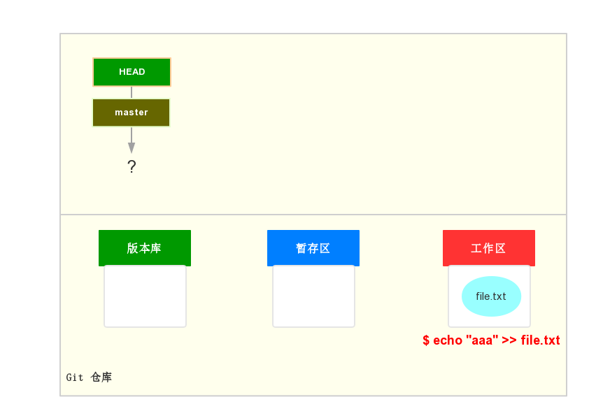
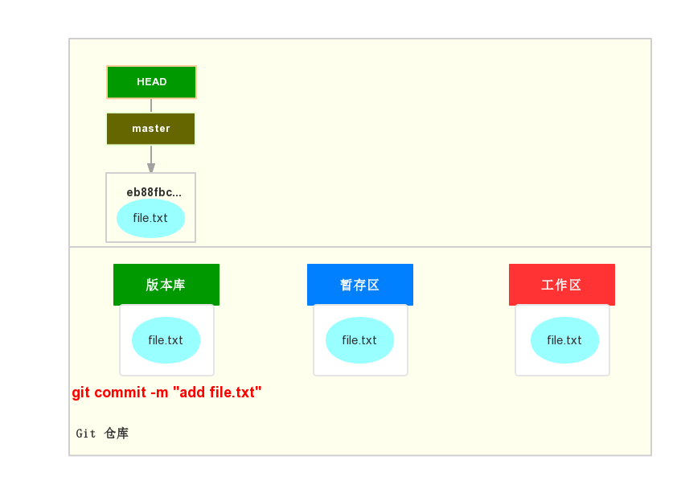

# Git 版本库

> 本小节主要是完成 Git 版本库的创建，以及完成第一个文件的版本控制

什么是版本库，版本库又叫做仓库（repository）。其实就是一个目录，不过这个目录中文件的变化是由 Git 管理和追踪的。

### 1. 创建版本库

```git
$ mkdir gitdemo
$ cd gitdemo
$ git init
  Initialized empty Git repository in E:/study/gitdemo/.git/
```

如上三条命令表示，创建 `gitdemo` 目录，并在 `gitdemo` 下初始化一个空的 Git 版本库。此时，你会发现此目录下多了一个 `.git` 目录，这目录就是用来追踪和管理版本库的，这也就是本地版本库。此目录下的文件尽量不要手工修改，否则会搞乱版本库。

### 2. 让 Git 管理你的文件

既然使用 Git 作为版本管理系统来管理自己的文件，那就必须了解 Git 的基本命令，以及命令之后文件所发生的变化。下面就以某个文件为示例，演示一下 Git 的基本命令，以及文件所处分区的变化情况。

刚刚创建新的版本库之后，Git 各个分区的状态如图所示：


此时，工作区、暂存区、版本库均是空的，即我们现在没有任何文件来让 Git 管理。下面我们就添加一个文本文件。

```shell
$ echo "aaa" >> file.txt
```

此时 file.txt 在 Git 各个分区的情况如下图所示：

此时文件只是在工作区中，还没有被 Git 追踪。使用如下命令让 Git 追踪此文件：

```git
$ git add file.txt
```

此时 file.txt 所处的 Git 各个区间的情况如图所示：

此图并不代表有两个 file.txt ，此时还是如你看到的那样只有一个 file.txt，只不过 file.txt 已经被 Git 所追踪，但是还未提交到版本库。使用如下命令将 file.txt 提交到版本库。

```git
$ git commit -m "init my first commit"
```

此命令表示将 file.txt 提交到本地版本库，`-m` 表示提交时添加的注释。这也是与 SVN 的差别，SVN 的 `commit` 表示提交到远程仓库。此时，file.txt 所处 Git 的各个区间的情况如下图所示：

到此步，file.txt 已完全有 Git 管理了。`eb88fbc...` 表示文件被提交到 Git 版本库的版本号。和 SVN 不一样，Git 的版本号不是 1，2，3 ... 递增的数字，而是使用 SHA1 计算出来的一个字符串。

### 小结：

现在总结一下学到的四点内容：
首先使用 `git init` 创建版本库，开启 Git 版本库之旅。
第二了解了 Git 的基本命令，`git add <file>` 和 `git commit -m "messages..."`，分别表示将文件添加到暂存区和版本库。
第三，使用画图的方式了解了文件在 Git 各个区间的变化情况。
第四，知道了 Git 与 SVN 版本号的差异，Git 使用的是 SHA1 值。